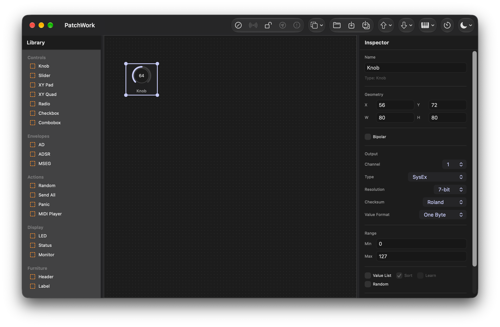
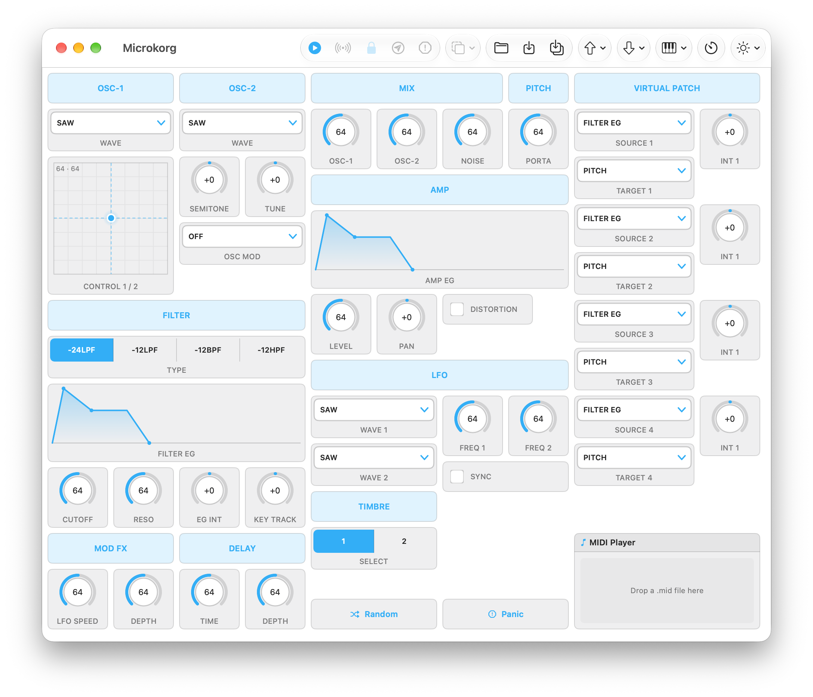
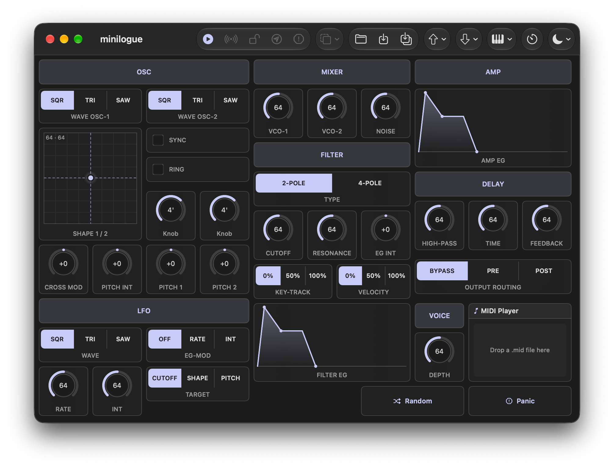
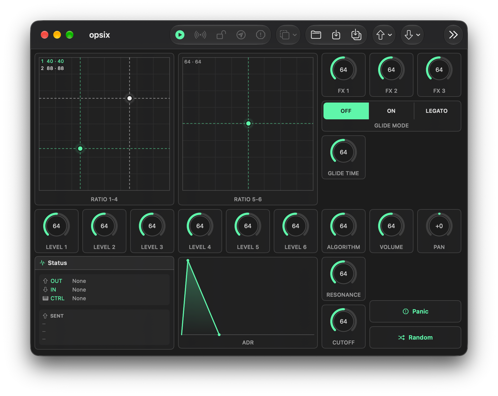

# PatchWork

Build your own macOS control panel for any MIDI device.

PatchWork is a native SwiftUI editor for hardware that has more parameters than
front-panel knobs. You drag controls onto a canvas, give each one a MIDI
address, and switch the canvas into Active Mode — from then on it is a working
editor for that synth, sampler or effect, saved as a single `.pwork` file you
can share.

Nothing about it is device-specific. A panel is just a layout plus addresses,
so the same app drives a 1988 rack unit over SysEx and a current desktop synth
over NRPN.



```
No SignUp
No User Profiling
No Tracking
No Cookie Banners
No Terms & Conditions
No Paywalls
No Ads
No Data Mining
```

PatchWork is an offline application. It has no network code, contacts no
server and collects no analytics; it is sandboxed and built without the
network entitlement, so it cannot open an outgoing connection even if it
tried. Its only entitlements are the sandbox, read-write access to the
files you pick, and CoreMIDI, which needs none of its own.

## Features

**Two modes.** Editor Mode arranges the panel — grid, drag, resize, rubber-band
select. Active Mode (`⌘R`) hides all of that and leaves you the instrument. Lock
(`⌘L`) freezes an arrangement so nothing shifts by accident while you play it.

**19 control types.** Knob, Slider, XY Pad, XY Quad, Radio, Checkbox, Combobox,
AD / ADSR / MSEG envelopes, Random, Send All, Panic, MIDI Player, LED, Status,
Monitor, Header, Label.

**Four MIDI protocols.** CC, NRPN (both MSB/LSB and LSB/MSB byte orders),
Program Change, and SysEx with a template language that covers value encodings
and bracketed checksum ranges. Resolution is per element, 7-bit or 14-bit.

**MIDI Learn** (`⌘K`). Arm a control, move the matching knob on the device, and
the address fills itself in. Learn listens to the **Input and only the Input** —
that is the instrument the panel is being built for, and its addresses are the
ones the panel needs. A Controller has CC numbers of its own, which describe the
Controller.

**Value Lists.** Give a control named entries instead of raw numbers. A Knob or
Slider then has one stop per entry, evenly spaced whatever the numbers are, and
shows the entry's name where its value would be. **Sort** decides the order:
ascending by number, or exactly as the list is written — which is what a Nord
Lead needs, its wave types being numbered A1 on CC 5, A2 on CC 2, A3 on CC 8
while the instrument lists them A1, A2, A3. Min and Max do not apply while a
list is in force; the list defines the values. Lists copy and paste between
elements on their own, separately from the elements themselves.

**Learn Values.** The other half of MIDI Learn, and on the same Input-only
rule. Learn points a control at a parameter; this collects the values that
parameter takes. Tick **Learn**
beside the Value List switch, step the control on the device, and its numbers
arrive in the list in the order they come — repeats skipped, other controls
ignored, names left to type over the top. **Clear List** empties it again, and
that one goes back through Undo.

**Throttled SysEx transfer.** Old devices have no flow control and drop bytes
they cannot parse in time. Chunk size, inter-chunk delay and inter-message delay
are all adjustable, because every device manual argues about those three
numbers.

**MIDI Monitor** (`⇧⌘M`, under Tools). A window of its own, independent of any
panel: every message on the ports, each shown twice — raw as it arrived and
decoded as PatchWork read it, so an NRPN appears both as its three Control
Changes and as the one parameter they meant. SysEx is spelled out in full here,
which the panel's Monitor element has no room for. Filter by direction and
message type, search the text, pause without losing anything, and copy the
filtered log out in one go. Clock and Active Sensing are recorded but hidden
until you ask for them.

**MIDI file playback.** Drop a `.mid` file into a MIDI Player element and loop
it through the panel's output — handy for auditioning while you tweak.

## Presets

[`Presets/`](Presets) holds ready-made panels for the Korg microKORG, minilogue
and opsix — 56, 42 and 22 controls. Open one to get a working editor for that
device without laying anything out first, or take one apart to see how a panel
is put together. See [`Presets/README.md`](Presets/README.md) for what each one
assumes.

  

## Requirements

- macOS 26.5 or later
- Xcode 26 (Swift 5 language mode) to build
- No dependencies beyond the system frameworks: SwiftUI, AppKit and CoreMIDI

## Installing a release build

The app is signed ad-hoc rather than with a Developer ID, so Gatekeeper will
refuse it on first launch — "PatchWork" cannot be opened because the developer
cannot be verified. Right-click the app and choose **Open**, then confirm; macOS
remembers the decision and later launches are normal. This is what an unsigned
build looks like, not a sign that anything is wrong with the download — the
checksum published with each release is there to check that.

## Building

Open `PatchWork.xcodeproj` in Xcode and build the `PatchWork` scheme.

For a distributable disk image:

```bash
./build_dmg.sh --no-install
```

This produces `build/PatchWork-<version>.dmg`. Drop `--no-install` if you also
want the release build copied into `/Applications`.

## Verification

There is no test target. Instead `Verification/main.swift` is a standalone
harness for the MIDI layer — the part where a bug is silent rather than visible.
It checks every message planner case against reference output, runs the stream
parser and NRPN decoder over hand-built byte streams, and pushes real bytes
through CoreMIDI in both directions using a virtual source and destination it
creates itself, so it needs no MIDI hardware attached.

Compile it against the sources it exercises; the exact `swiftc` invocation is in
the file's header comment.

## File format

A `.pwork` file is JSON — the placed elements and whether the layout is locked.
It declares conformance to `public.json` rather than hiding behind a custom
type, so anything that reads JSON can read a panel.

## Licence

MIT — see [LICENSE](LICENSE). No third-party code is included.

## Contact

T'Zorr — <TZorr@gmx.de>
